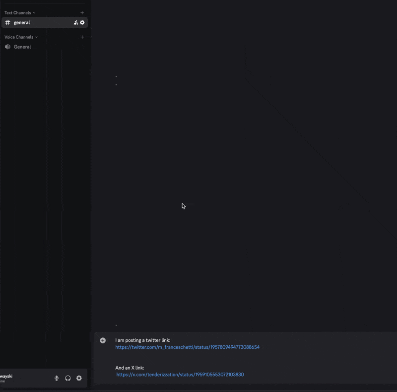

## VXBot

Replaces links in Discord so that video embeds work properly:
- `twitter.com` and `x.com` with [vxtwitter.com](https://github.com/dylanpdx/BetterTwitFix)
- `facebook.com` with [facebed.com](https://github.com/facebed/facebed)
- `instagram.com` with [eeinstagram.com](https://github.com/Wikidepia/InstaFix)

